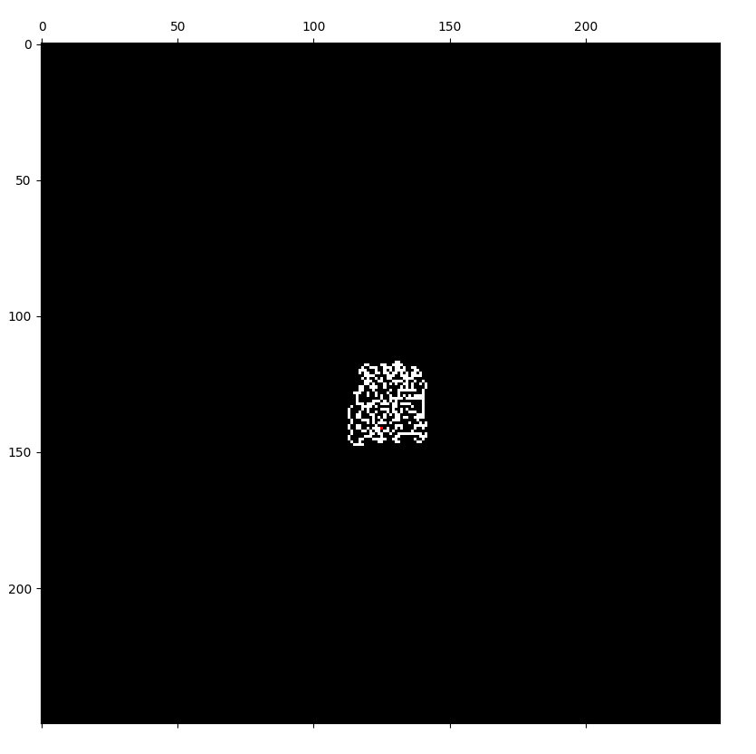

# Getting Started with langton_ants

This project was developed by myself for a master's degree program class. If you are Brazilian, like me, and don't have any English knowledge, please read the "[br_README.md](./README_br.md)" file in this repository!

---

In order to run the code, you need to have Python installed. This specific version was developed on [Python 3.13.7](https://www.python.org/downloads/release/python-3137/), but it honestly should run under different lower (and, for now, higher) Python versions.

## First steps

For this walkthrough I will stick to Windows examples on how to run it, since it is the OS the application was developed on. For any other OS users, feel free to contact me in case of any problems (even though I don't think they should happen). For Windows users, I will run commands on the bash terminal, but it should work fine on the command prompt!

First, create your virtual environment. On Windows it should work by typing the following command on your bash terminal:

```shell
py -m venv .venv
```

To activate it, if your IDE has not already located it as your Python environment, run on your bash terminal:

```bash
source .venv/Scripts/activate 
```

If you are using command prompt, you should have an error here. Instead, run:

```cmd
.venv/Scripts/activate 
```

Finally, you need to install the necessary dependencies. Run on your bash terminal:

```bash
pip install -r requirements.txt
```

It will install the Python libraries in the correct version.

## Running the actual code

The code is, for now, very simple, even though it should receive some updates in the future. It simulates the Langton ant cellular automaton, running on a matrix defined by you. It has a world-wrapping property (if the lattice ends, the ant should appear directly on the opposite side) and simulates the base ant proposed by Christopher Langton.

After the simulation runs for a while, you may notice some emergent behavior being shown by the ant. Changing the ant behavior may show unexpected behavior.

To run the code, you may just type on your bash terminal:

```shell
python src/main.py
```

And it will run the simulation on its standard settings. The `main.py` file has the following (important) information:

```py
if __name__ == "__main__":

    ant = Ant((125, 125))
    anthill = Map(ant, 250, 250)
    anthill.simulate(steps=500, debug=True)
```

This is the code that simulates the ant. If you want to change the initial configuration, understand the following:

```py
def __init__(self, starting_position: tuple[int, int] = (0, 0), starting_direction: Literal["r", "l", "u", "d"] = "r", current_square: int = 0):

    self.position = starting_position
    self.direction = starting_direction
    self.current_square = current_square
```

The ant has some attributes that will influence its behavior. For each attribute, there are some conditions to it.

* Ant attributes:

  1. `self.position`: Position is the starting location of the ant. It is a tuple of integers and will determine the location of the ant at the start of the simulation. Even though it may appear obvious, it is important to know that the starting location should be within the index range of the lattice (anthill). The starting location tuple (x and y axis) shouldn't be located at a higher range than the anthill dimensions (remember that this works like a Python list, so the max value for the ant x and y values is the Map x and y value minus one).
  2. `self.direction`: It's important to know that the movement of the ant depends on its looking direction. Moving "left" or "right" depends on the ant's perspective. This argument changes the ant's initial perspective direction at its starting position. For further clarification, it should assume one of the following values: `["r", "l", "u", "d"]`. For each one of these:

     * `"r"` stands for **RIGHT**;
     * `"l"` stands for **LEFT**;
     * `"u"` stands for **UP**;
     * `"d"` stands for **DOWN**.
  3. `self.current_square`: This attribute is the reading of the ant for the current square it is standing on. If you choose (for whatever reason) to start with a not completely black lattice, this argument should have a proper use, but it should not be used. In further implementations, it will be discontinued as a parameter of the constructor.

The anthill variable is the grid lattice where the code runs. If you want to change the initial configuration, understand the following:

```py
def __init__(self, ant: Ant, rows: int = 500, columns: int = 500):

    self.anthill = np.zeros((rows, columns))
    self.ant = ant
```

* Anthill attributes:

  1. Arguments (rows, columns): it defines the number of rows and columns present on the lattice. It should define the "world" size. As said before, the number of rows should be higher than the x-dimension starting position of the ant; the number of columns should be higher than the y-dimension starting position of the ant.
  2. `self.anthill`: Based on the number of rows and columns, a matrix of zeros will be initialized, with the dimensions based on the previous arguments.
  3. `self.ant`: This argument is based on the ant generated previously.

Finally, the function `anthill.simulate([...])` is responsible for running and rendering the matrix. It uses the matplotlib function `matshow` to render the plot on your screen. It receives two arguments:

```py
def simulate(self, steps: int = 1, debug: bool = False) -> None:
```

* simulate method arguments:

  1. `steps`: Basically, it shows how many steps it will "skip" every iteration. For a smooth and kinda fast approach, I suggest running it as the given parameter: 125 steps. For initial visualization and understanding of what is happening, I suggest starting with a smaller step speed.
  2. `debug`: This one exists for debug purposes. It is a boolean and determines if the current step will be shown. It exists only for debugging purposes and is not very useful at all; feel free to turn it off, since it may lag your visualization.

With this in mind, you are mainly able to see the code working. Type the previously mentioned command on your bash terminal and you may see something like this:



## Ending the simulation

If (when) you want to end the running program, you may find it kinda hard. First, just close the rendered grid. On your bash terminal, press `CTRL + C`, and it will end smoothly.

## Finally

Thanks for reading up until here! Feel free to contact me through any of my socials (you can see them on my GitHub profile landing page) if you are interested in any aspect of the project or have any kind of suggestion. Enjoy simulating ants!
